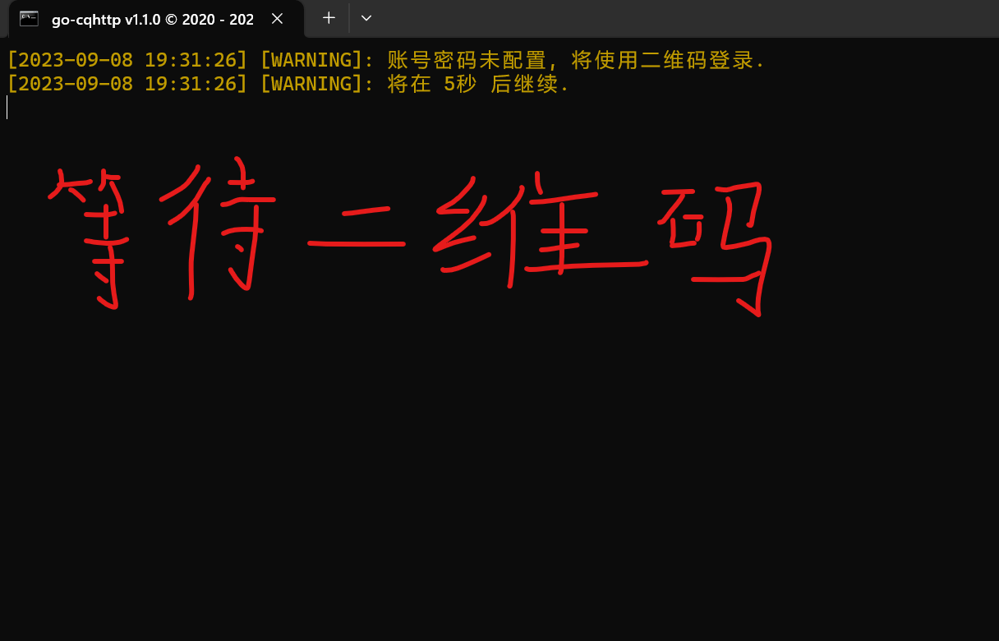
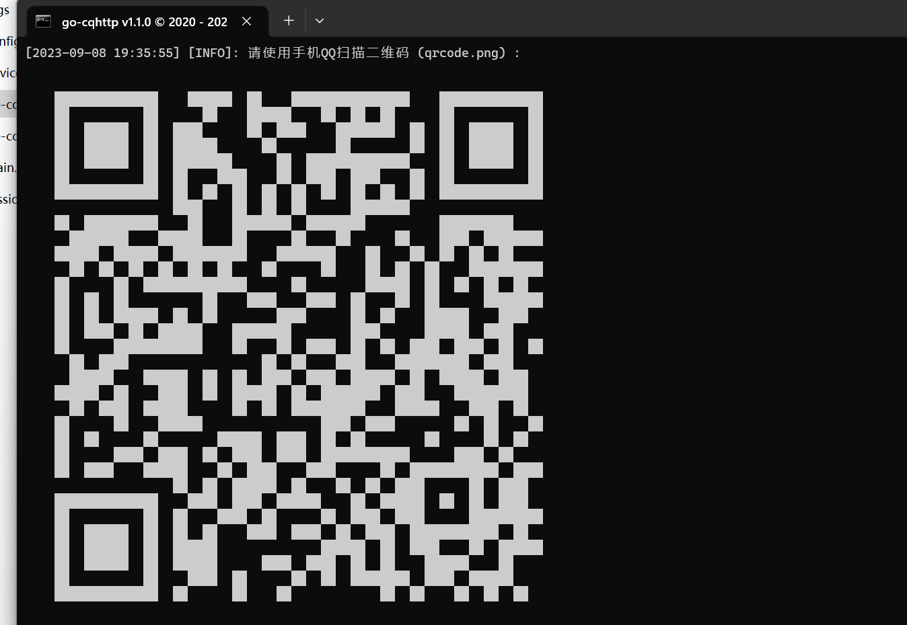

### Emiya启动文档
1. 在下载好Emiya框架后，我们首先找到main.py文件。

2. 然后双击打开，打开之后是一个代码编辑界面，

3. 然后直接运行（注意：如果有标红提示，请先安装对应的库文件）。

4. 在运行main.py文件后，我们再找到go-cqhttp.bat文件，

5. 双击运行，等待需要扫码登录的二维码（注意，默认大小的窗口里，二维码可能显示不全，‘’Ctrl‘’ + ‘’-’’  将字体缩小即可）。

6. 二维码显示出来后，使用需要用作机器人的QQ进行扫码登录（注意：二维码在2分钟后就会过期，此时就得重新运行文件等待二维码）
7. 扫码成功后需要确认登录，登陆成功后如图

